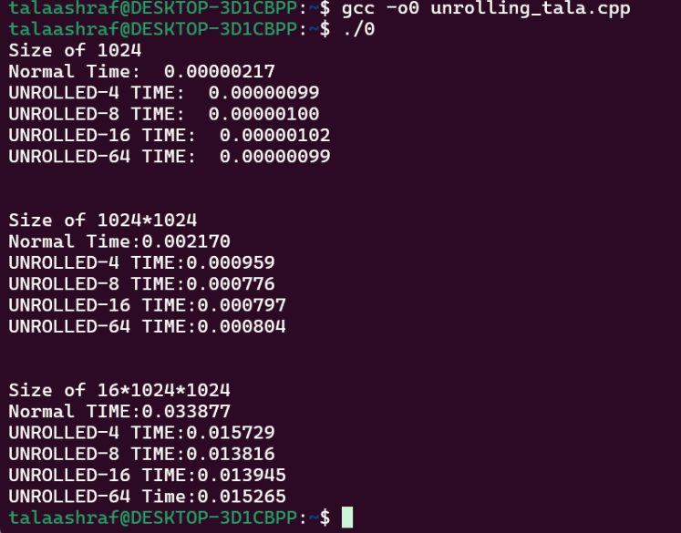

# Loop Unrolling Performance Comparison

This project compares the performance of normal loops and unrolled loops with different degrees (4, 8, 16, 64) using an array of different sizes (1024, 1024*1024, 16*1024*1024). The main objective is to measure how loop unrolling affects execution time and speedup.

## Table of Contents
- [Installation](#installation)
- [Results](#results)

## Installation
To run the project on your local machine, make sure you have the following:
- GCC compiler for C
- Linux or Windows with MinGW for compiling

### Compile the code:
    gcc -o loop_unrolling unrolling.c

## Results
The program prints the execution time for the normal loop and the unrolled loops with varying degrees. It also computes the speedup achieved by each unrolling degree.

